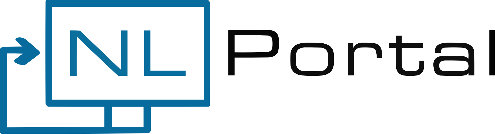

This repository contains reference implementations for the NL Portal Backend and Frontend Apps.
It also contains a Docker Compose file for starting up a pre-configured NL Portal Demo without having to write any code.

## Running the application

Follow one of the following guides to start up the application:
* [Run the latest prebuilt app](#pulling-and-running-latest-prebuilt-apps)
* [Build and run your own app](#building-and-running-your-own-apps) 

### Pulling and running latest prebuilt apps

#### Requirements

The following software has to be installed to be able to use this application:
* Docker Desktop

Running the latest public docker images can be done via your favourite IDE by running the `docker-compose` file with
the `remote` profile or by running the following command in your terminal:

```shell
docker compose --profile remote --profile zgw up -d
```

This will pull the latest public release of the NL Portal backend and frontend apps alongside all the
necessary ZGW components required to demo NL Portal functionality.

The NL Portal application will be accessible at http://localhost:3000 and can be interacted with the following demo user:
* Username: `burger`
* Password: `burger`

**NB! The startup of all the ZGW components can take multiple minutes depending on how powerful your computer is.**

### Building and running your own apps

#### Requirements

The following software has to be installed to be able to use this application:
* Docker Desktop
* JDK 21
* NodeJS 20

The Docker Compose file also provides an option to build your own app images and run them should you make changes to the
Backend and/or Frontend app e.g. changing the colors and logo in the Frontend app or customizing features.

Follow these steps after doing your modifications to the sources by running the commands in your terminal or command-line:

1. Build the backend app
   ```shell
   cd backend
   ./gradlew bootJar
   ```
1. Build the frontend app
   ```shell
   npm i -g pnpm && pnpm -C frontend i && pnpm -C frontend build
   ```
1. Build and compose the app images with docker
   ```shell
   docker compose --profile local --profile zgw up -d --build
   ```

The NL Portal application will be accessible at http://localhost:3000 and can be interacted with the following demo user:
* Username: `burger`
* Password: `burger`

**NB! The startup of all the ZGW components can take multiple minutes depending on how powerful your computer is.**